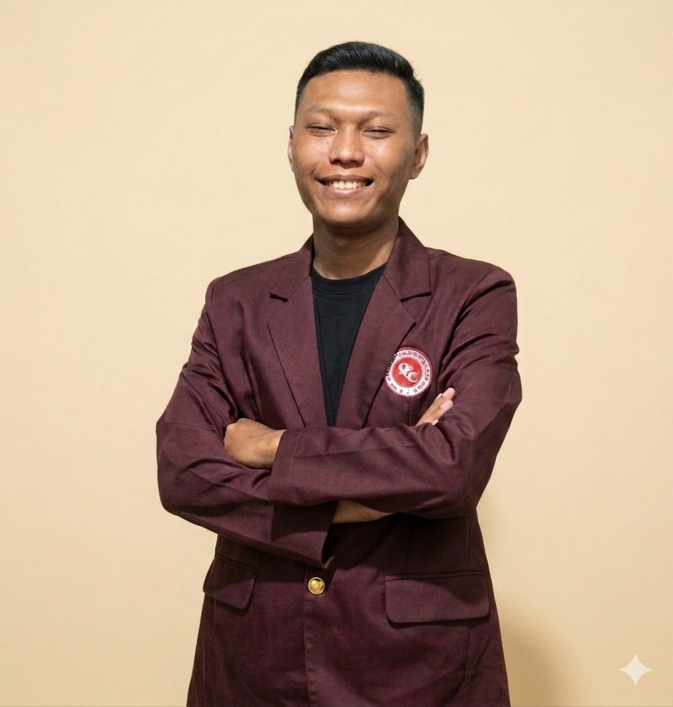

<!DOCTYPE html>
<html lang="id">
<head>
    <meta charset="UTF-8">
    <meta name="viewport" content="width=device-width, initial-scale=1.0">
    <title>Portfolio - Profesional & Sistem Informasi</title>
    <link rel="preconnect" href="https://fonts.googleapis.com">
    <link href="https://fonts.googleapis.com/css2?family=Inter:wght@400;500&family=Poppins:wght@600;700&display=swap" rel="stylesheet">
    <link rel="stylesheet" href="style.css">
    <link rel="stylesheet" href="https://cdnjs.cloudflare.com/ajax/libs/font-awesome/6.0.0/css/all.min.css">
    
</head>
<body>
    <nav>
        
DigitalCV

        <button class="menu-toggle" id="menu-toggle" aria-label="Open Menu">
            
            
            
        </button>
        <ul class="nav-links">
            <li><a href="#about" data-i18n="nav_about">Tentang</a></li>
            <li><a href="#education" data-i18n="nav_edu">Pendidikan</a></li>
            <li><a href="#experience" data-i18n="nav_exp">Pengalaman</a></li>
            <li><a href="#skills" data-i18n="nav_skills">Keahlian</a></li>
            <li><a href="#portfolio" data-i18n="nav_port">Proyek</a></li>
            <li><a href="#contact" data-i18n="nav_contact">Kontak</a></li>
        </ul>
        

            <button class="lang-btn active" id="lang-id">ID</button>
            <button class="lang-btn" id="lang-en">EN</button>
        

        <button id="theme-toggle" aria-label="Toggle Dark Mode">🌙</button>
    </nav>

    <header class="hero">
        

            
            <h1>Halo, Saya Ricky Yudha Pratama</h1>
            
Information Systems Student | Specialist in Parking Management Systems

            

                <a href="#contact" class="btn" data-i18n="hero_btn_contact">Hubungi Saya</a>
                <a href="file cv/CV_ats Ricky Yudha Pratama.pdf" class="btn btn-outline" download data-i18n="hero_btn_cv">Unduh CV (PDF)</a>
            

        

    </header>

    <section id="about" class="container">
        <h2 data-i18n="about_h2">Tentang Saya</h2>
        

            

                Saya merupakan lulusan SMK Asy Syifa jurusan Rekayasa Perangkat Lunak yang saat ini aktif menempuh pendidikan S1 Sistem Informasi di Institut Teknologi Bisnis & Bahasa Dian Cipta Cendekia. Memiliki ketertarikan kuat di bidang teknologi informasi, saya terbiasa belajar hal baru, beradaptasi dengan cepat, serta terus mengembangkan kemampuan baik secara teknis maupun non-teknis. Saya adalah pribadi yang terbuka terhadap pengalaman baru, memiliki motivasi tinggi untuk berkembang, dan siap memberikan kontribusi terbaik dalam lingkungan kerja profesional.
            

        

    </section>

    <section id="education" class="container bg-light">
        <h2 data-i18n="edu_h2">Pendidikan</h2>
        

            

                <h3 data-i18n="edu_s1">S1 Sistem Informasi</h3>
                
Institut Teknologi Bisnis & Bahasa Dian Cipta Cendekia

                
2024 - Sekarang

            

            

                <h3 data-i18n="edu_smk">Rekayasa Perangkat Lunak</h3>
                
SMK ASY-SYIFA

                
2018 - 2021

            

        

    </section>

    <section id="experience" class="container">
        <h2 data-i18n="exp_h2">Pengalaman Kerja</h2>
        

            

                <h3>Car Part Manager</h3>
                
PT Rapik Karya Mandiri

            

            <ul class="exp-list">
                <li data-i18n="exp_l1">Mengelola operasional parkir harian dan memastikan kepatuhan ketat terhadap SOP perusahaan.</li>
                <li data-i18n="exp_l2">Mengatur lalu lintas kendaraan dan mengoptimalkan pemanfaatan area parkir.</li>
                <li data-i18n="exp_l3">Memimpin tim operasional, menyusun jadwal kerja, dan memberikan pelatihan rutin kepada staf.</li>
                <li data-i18n="exp_l4">Bertanggung jawab penuh atas laporan pendapatan harian dan pengelolaan arus kas (cash management).</li>
                <li data-i18n="exp_l5">Memastikan sistem integrasi parkir dan infrastruktur keamanan (CCTV) berfungsi optimal.</li>
                <li data-i18n="exp_l6">Menangani dan menyelesaikan keluhan pelanggan dengan pendekatan profesional.</li>
            </ul>
        

    </section>

    <section id="skills" class="container bg-light">
        <h2 data-i18n="skills_h2">Kemampuan</h2>
        

            

                <h3 data-i18n="skills_hard">Hard Skill</h3>
                

                    Dasar Manajemen Sistem & Operasional
                    

                

                

                    Microsoft Excel (Reporting Data)
                    

                

                

                    Troubleshooting (CCTV / Sistem Parkir)
                    

                

            

            

                <h3 data-i18n="skills_soft">Soft Skill</h3>
                <ul class="soft-skills-list">
                    <li data-i18n="soft_l1">Problem solving</li>
                    <li data-i18n="soft_l2">Cepat belajar teknologi baru</li>
                    <li data-i18n="soft_l3">Adaptif terhadap sistem baru</li>
                    <li data-i18n="soft_l4">Komunikasi tim yang baik</li>
                    <li data-i18n="soft_l5">Berpikir analitis</li>
                </ul>
            

        

    </section>

    <section id="portfolio" class="container">
        <h2 data-i18n="port_h2">Proyek Pilihan</h2>
        

            <button class="filter-btn active" data-filter="all" data-i18n="port_all">Semua</button>
            <button class="filter-btn" data-filter="data">Data</button>
            <button class="filter-btn" data-filter="web">Web</button>
        

        

            

                <h3 data-i18n="port_p1_h3">Sistem Pelaporan Pendapatan Parkir</h3>
                
Aplikasi berbasis web untuk mengotomatisasi laporan keuangan parkir harian, mengurangi kesalahan input manual secara signifikan.

                

                    Masih dalam tahap pengembangan
                

            

            

                <h3 data-i18n="port_p2_h3">Web Personal Branding</h3>
                
Website portfolio interaktif ini dibangun menggunakan Vanilla CSS dan JavaScript untuk menunjukkan kemampuan front-end.

                

                    <a href="https://rickyydhp.github.io/rombakan3/" target="_blank" rel="noopener noreferrer"><i class="fab fa-github"></i> Lihat Proyek</a>
                

            

        

    </section>

    <section id="contact" class="container">
        <h2 data-i18n="cont_h2">Kontak</h2>
        

            
<i class="fas fa-envelope"></i> <strong>Email:</strong> <a href="mailto:ricky.cihernak@email.com">ricky.cihernak@email.com</a>

            
<i class="fab fa-instagram"></i> <strong>Instagram:</strong> 
                <a href="https://www.instagram.com/rickyydhp/" target="_blank" rel="noopener noreferrer">@rickyydhp</a>
            

        

        <form id="contactForm">
            

                <label for="name" data-i18n="cont_label_name">Nama Lengkap</label>
                <input type="text" id="name" placeholder="Masukkan nama Anda" required data-i18n="cont_ph_name">
            

            

                <label for="email" data-i18n="cont_label_email">Alamat Email</label>
                <input type="email" id="email" placeholder="email@contoh.com" required data-i18n="cont_ph_email">
            

            

                <label for="message" data-i18n="cont_label_msg">Pesan</label>
                <textarea id="message" placeholder="Apa yang bisa saya bantu?" required data-i18n="cont_ph_msg"></textarea>
            

            <button type="submit" class="btn" data-i18n="cont_btn_send">Kirim Pesan</button>
        </form>
    </section>

    <footer>
        
&copy; 2026 RICKY YUDHA PRATAMA. Dibuat Untuk Tugas Web Programming.

    </footer>
</body>
</html>

document.addEventListener('DOMContentLoaded', () => {
    // Kamus Terjemahan
    const translations = {
        id: {
            nav_about: "Tentang",
            nav_edu: "Pendidikan",
            nav_exp: "Pengalaman",
            nav_skills: "Keahlian",
            nav_port: "Proyek",
            nav_contact: "Kontak",
            hero_tagline: "Information Systems Student | Specialist in Parking Management Systems",
            hero_greeting_morning: "Selamat Pagi",
            hero_greeting_afternoon: "Selamat Siang",
            hero_greeting_evening: "Selamat Malam",
            hero_intro: "Saya",
            hero_btn_contact: "Hubungi Saya",
            hero_btn_cv: "Unduh CV (PDF)",
            about_h2: "Tentang Saya",
            about_p1: "Saya merupakan lulusan SMK Asy Syifa jurusan Rekayasa Perangkat Lunak yang saat ini aktif menempuh pendidikan S1 Sistem Informasi di Institut Teknologi Bisnis & Bahasa Dian Cipta Cendekia. Memiliki ketertarikan kuat di bidang teknologi informasi, saya terbiasa belajar hal baru, beradaptasi dengan cepat, serta terus mengembangkan kemampuan baik secara teknis maupun non-teknis. Saya adalah pribadi yang terbuka terhadap pengalaman baru, memiliki motivasi tinggi untuk berkembang, dan siap memberikan kontribusi terbaik dalam lingkungan kerja profesional.",
            edu_h2: "Pendidikan",
            edu_s1: "S1 Sistem Informasi",
            edu_s1_period: "2024 - Sekarang",
            edu_smk: "Rekayasa Perangkat Lunak",
            exp_h2: "Pengalaman Kerja",
            exp_l1: "Mengelola operasional parkir harian dan memastikan kepatuhan ketat terhadap SOP perusahaan.",
            exp_l2: "Mengatur lalu lintas kendaraan dan mengoptimalkan pemanfaatan area parkir.",
            exp_l3: "Memimpin tim operasional, menyusun jadwal kerja, dan memberikan pelatihan rutin kepada staf.",
            exp_l4: "Bertanggung jawab penuh atas laporan pendapatan harian dan pengelolaan arus kas (cash management).",
            exp_l5: "Memastikan sistem integrasi parkir dan infrastruktur keamanan (CCTV) berfungsi optimal.",
            exp_l6: "Menangani dan menyelesaikan keluhan pelanggan dengan pendekatan profesional.",
            skills_h2: "Kemampuan",
            skills_hard: "Hard Skill",
            skills_soft: "Soft Skill",
            skill_mgt: "Dasar Manajemen Sistem & Operasional",
            skill_excel: "Microsoft Excel (Reporting Data)",
            skill_trouble: "Troubleshooting (CCTV / Sistem Parkir)",
            soft_l1: "Problem solving",
            soft_l2: "Cepat belajar teknologi baru",
            soft_l3: "Adaptif terhadap sistem baru",
            soft_l4: "Komunikasi tim yang baik",
            soft_l5: "Berpikir analitis",
            port_h2: "Proyek Pilihan",
            port_all: "Semua",
            port_p1_h3: "Sistem Pelaporan Pendapatan Parkir",
            port_p1_p: "Aplikasi berbasis web untuk mengotomatisasi laporan keuangan parkir harian, mengurangi kesalahan input manual secara signifikan.",
            port_p1_dev: "Masih dalam tahap pengembangan",
            port_p2_h3: "Web Personal Branding",
            port_p2_p: "Website portfolio interaktif ini dibangun menggunakan Vanilla CSS dan JavaScript untuk menunjukkan kemampuan front-end.",
            port_p2_link: "Lihat Proyek",
            cont_h2: "Kontak",
            cont_label_name: "Nama Lengkap",
            cont_ph_name: "Masukkan nama Anda",
            cont_label_email: "Alamat Email",
            cont_ph_email: "email@contoh.com",
            cont_label_msg: "Pesan",
            cont_ph_msg: "Apa yang bisa saya bantu?",
            cont_btn_send: "Kirim Pesan",
            footer_text: "© 2026 RICKY YUDHA PRATAMA. Dibuat Untuk Tugas Web Programming."
        },
        en: {
            nav_about: "About",
            nav_edu: "Education",
            nav_exp: "Experience",
            nav_skills: "Skills",
            nav_port: "Projects",
            nav_contact: "Contact",
            hero_tagline: "Information Systems Student | Specialist in Parking Management Systems",
            hero_greeting_morning: "Good Morning",
            hero_greeting_afternoon: "Good Afternoon",
            hero_greeting_evening: "Good Evening",
            hero_intro: "I am",
            hero_btn_contact: "Contact Me",
            hero_btn_cv: "Download CV (PDF)",
            about_h2: "About Me",
            about_p1: "I am a graduate of SMK Asy Syifa majoring in Software Engineering, currently actively pursuing a Bachelor's degree in Information Systems at ITBA DCC. Having a strong interest in information technology, I am accustomed to learning new things, adapting quickly, and continuously developing both technical and non-technical skills. I am an individual open to new experiences, highly motivated to grow, and ready to provide the best contribution in a professional work environment.",
            edu_h2: "Education",
            edu_s1: "Bachelor of Information Systems",
            edu_s1_period: "2024 - Present",
            edu_smk: "Software Engineering",
            exp_h2: "Work Experience",
            exp_l1: "Manage daily parking operations and ensure strict compliance with company SOPs.",
            exp_l2: "Direct vehicle traffic and optimize parking area utilization.",
            exp_l3: "Lead operational teams, organize work schedules, and provide routine training to staff.",
            exp_l4: "Fully responsible for daily revenue reports and cash flow management.",
            exp_l5: "Ensure parking integration systems and security infrastructure (CCTV) function optimally.",
            exp_l6: "Handle and resolve customer complaints with a professional approach.",
            skills_h2: "Skills",
            skills_hard: "Hard Skills",
            skills_soft: "Soft Skills",
            skill_mgt: "Basic System Management & Operations",
            skill_excel: "Microsoft Excel (Data Reporting)",
            skill_trouble: "Troubleshooting (CCTV / Parking Systems)",
            soft_l1: "Problem solving",
            soft_l2: "Quick learner of new technologies",
            soft_l3: "Adaptive to new systems",
            soft_l4: "Good team communication",
            soft_l5: "Analytical thinking",
            port_h2: "Selected Projects",
            port_all: "All",
            port_p1_h3: "Parking Revenue Reporting System",
            port_p1_p: "A web-based application to automate daily parking financial reports, significantly reducing manual input errors.",
            port_p1_dev: "Under development",
            port_p2_h3: "Web Personal Branding",
            port_p2_p: "This interactive portfolio website was built using Vanilla CSS and JavaScript to demonstrate front-end skills.",
            port_p2_link: "View Project",
            cont_h2: "Contact",
            cont_label_name: "Full Name",
            cont_ph_name: "Enter your name",
            cont_label_email: "Email Address",
            cont_ph_email: "email@example.com",
            cont_label_msg: "Message",
            cont_ph_msg: "How can I help you?",
            cont_btn_send: "Send Message",
            footer_text: "© 2026 RICKY YUDHA PRATAMA. Created For Web Programming Assignment."
        }
    };

    // 1. Fitur Dark Mode dengan Penyimpanan Lokal
    const themeToggle = document.getElementById('theme-toggle');
    
    // Cek preferensi sebelumnya
    const currentTheme = localStorage.getItem('theme') || 'light';
    if (currentTheme === 'dark') {
        document.documentElement.setAttribute('data-theme', 'dark');
        themeToggle.textContent = '☀️';
    }

    themeToggle.addEventListener('click', () => {
        let theme = document.documentElement.getAttribute('data-theme');
        if (theme === 'dark') {
            document.documentElement.removeAttribute('data-theme');
            localStorage.setItem('theme', 'light');
            themeToggle.textContent = '🌙';
        } else {
            document.documentElement.setAttribute('data-theme', 'dark');
            localStorage.setItem('theme', 'dark');
            themeToggle.textContent = '☀️';
        }
    });

    // 2. Animasi Reveal saat Scroll (Intersection Observer)
    const observerOptions = {
        threshold: 0.15
    };

    const observer = new IntersectionObserver((entries) => {
        entries.forEach(entry => {
            if (entry.isIntersecting) {
                entry.target.classList.add('active');
                
                // Trigger animasi fill untuk progress bar jika ada di dalam section ini
                const progressBars = entry.target.querySelectorAll('.progress');
                progressBars.forEach(bar => {
                    const targetWidth = bar.getAttribute('data-width');
                    bar.style.width = targetWidth;
                });
            }
        });
    }, observerOptions);

    // Mendaftarkan section dan elemen lainnya untuk di-observe
    document.querySelectorAll('section, .project-card, .timeline-item, .experience-card').forEach(el => {
        el.classList.add('reveal');
        observer.observe(el);
    });

    // 3. Validasi Formulir Kontak
    const contactForm = document.getElementById('contactForm');
    contactForm.addEventListener('submit', (e) => {
        e.preventDefault();
        
        const name = document.getElementById('name').value.trim();
        const email = document.getElementById('email').value.trim();
        const message = document.getElementById('message').value.trim();

        if (name === "" || email === "" || message === "") {
            alert("Mohon lengkapi semua data sebelum mengirim.");
            return;
        }

        // Simulasi pengiriman berhasil
        alert(`Terima kasih ${name}, pesan Anda telah terkirim secara profesional!`);
        contactForm.reset();
    });

    // 4. Sistem Filter Portofolio
    const filterBtns = document.querySelectorAll('.filter-btn');
    const projectCards = document.querySelectorAll('.project-card');

    filterBtns.forEach(btn => {
        btn.addEventListener('click', () => {
            // Ubah status aktif tombol
            filterBtns.forEach(b => b.classList.remove('active'));
            btn.classList.add('active');

            const filterValue = btn.getAttribute('data-filter');

            projectCards.forEach(card => {
                const category = card.getAttribute('data-category');
                if (filterValue === 'all' || filterValue === category) {
                    card.classList.remove('hide');
                } else {
                    card.classList.add('hide');
                }
            });
        });
    });

    // 5. Fitur Ganti Bahasa
    const langBtns = document.querySelectorAll('.lang-btn');
    
    function setLanguage(lang) {
        const hour = new Date().getHours();
        let timeSuffix = "evening"; // Default Malam/Evening
        if (hour >= 5 && hour < 12) timeSuffix = "morning"; // Pagi
        else if (hour >= 12 && hour < 18) timeSuffix = "afternoon"; // Siang/Sore

        document.querySelectorAll('[data-i18n]').forEach(el => {
            let key = el.getAttribute('data-i18n');
            
            // Penanganan khusus untuk sapaan dinamis berdasarkan waktu
            let translationKey = key;
            if (key === "hero_greeting") translationKey = `${key}_${timeSuffix}`;

            if (translations[lang][translationKey]) {
                if (el.tagName === 'INPUT' || el.tagName === 'TEXTAREA') {
                    el.placeholder = translations[lang][translationKey];
                } else {
                    el.textContent = translations[lang][translationKey];
                }
            }
        });

        // Update status aktif tombol
        langBtns.forEach(btn => btn.classList.remove('active'));
        document.getElementById(`lang-${lang}`).classList.add('active');
        
        // Simpan preferensi
        localStorage.setItem('language', lang);
    }

    langBtns.forEach(btn => {
        btn.addEventListener('click', () => {
            const lang = btn.id.split('-')[1];
            setLanguage(lang);
        });
    });

    // Muat bahasa dari preferensi sebelumnya
    const savedLang = localStorage.getItem('language') || 'id';
    setLanguage(savedLang);

    // 6. Mobile Menu Toggle
    const menuToggle = document.getElementById('menu-toggle');
    const navLinks = document.querySelector('.nav-links');

    menuToggle.addEventListener('click', () => {
        navLinks.classList.toggle('active');
        menuToggle.classList.toggle('active');
    });

    // Tutup menu saat link diklik (untuk mobile)
    document.querySelectorAll('.nav-links a').forEach(link => {
        link.addEventListener('click', () => navLinks.classList.remove('active'));
    });
});

/* Konfigurasi Variabel Warna */
:root {
    --primary-color: #6366f1; /* Indigo yang lebih modern */
    --primary-gradient: linear-gradient(135deg, #6366f1 0%, #a855f7 100%);
    --bg-color: #f8fafc;
    --text-color: #0f172a;
    --card-bg: #ffffff;
    --nav-bg: rgba(99, 102, 241, 0.9);
    --transition: all 0.4s cubic-bezier(0.4, 0, 0.2, 1);
}

/* Variabel Dark Mode */
[data-theme="dark"] {
    --bg-color: #020617;
    --text-color: #f1f5f9;
    --card-bg: #1e293b;
    --nav-bg: rgba(30, 41, 59, 0.8);
}

/* Reset Dasar */
* {
    margin: 0;
    padding: 0;
    box-sizing: border-box;
}

body {
    font-family: 'Inter', sans-serif;
    background-color: var(--bg-color);
    color: var(--text-color);
    transition: var(--transition);
    line-height: 1.7;
}

h1, h2, h3 {
    font-family: 'Poppins', sans-serif;
}

html {
    scroll-behavior: smooth;
}

/* Navigasi */
nav {
    display: flex;
    justify-content: space-between;
    align-items: center;
    padding: 1rem 10%;
    background: var(--nav-bg);
    color: white;
    position: sticky;
    top: 0;
    z-index: 1000;
    backdrop-filter: blur(10px); /* Efek Glassmorphism */
    box-shadow: 0 4px 30px rgba(0, 0, 0, 0.1);
}

.nav-links {
    display: flex;
    list-style: none;
}

.nav-links li {
    margin-left: 25px;
}

.nav-links a {
    color: white;
    text-decoration: none;
    font-weight: 500;
    transition: opacity 0.3s;
}

.nav-links a:hover {
    opacity: 0.8;
}

/* Language Switcher */
.lang-switch {
    display: flex;
    gap: 5px;
    margin-right: 15px;
}

.lang-btn {
    background: rgba(255, 255, 255, 0.2);
    border: none;
    color: white;
    padding: 2px 8px;
    cursor: pointer;
    border-radius: 4px;
    font-size: 0.8rem;
    font-weight: bold;
}

.lang-btn.active {
    background: white;
    color: var(--primary-color);
}

#theme-toggle {
    background: none;
    border: 1px solid white;
    color: white;
    padding: 5px 10px;
    cursor: pointer;
    border-radius: 5px;
    font-size: 1.2rem;
}

/* Hero Section */
.hero {
    height: 90vh;
    display: flex;
    align-items: center;
    justify-content: center;
    text-align: center;
    background: linear-gradient(rgba(15, 23, 42, 0.8), rgba(15, 23, 42, 0.8)), 
                url('https://images.unsplash.com/photo-1451187580459-43490279c0fa?q=80&w=2072');
    background-size: cover;
    background-position: center;
    color: white;
}

.profile-img {
    width: 200px;
    height: 200px;
    border-radius: 30% 70% 70% 30% / 30% 30% 70% 70%; /* Bentuk organik agar tidak membosankan */
    border: 6px solid rgba(255, 255, 255, 0.2);
    margin-bottom: 1.5rem;
    object-fit: cover;
    animation: morph 8s ease-in-out infinite;
}

@keyframes morph {
    0% { border-radius: 30% 70% 70% 30% / 30% 30% 70% 70%; }
    50% { border-radius: 70% 30% 30% 70% / 70% 70% 30% 30%; }
    100% { border-radius: 30% 70% 70% 30% / 30% 30% 70% 70%; }
}

.hero-btns {
    margin-top: 1.5rem;
    display: flex;
    gap: 1rem;
    justify-content: center;
}

.btn {
    display: inline-block;
    padding: 12px 32px;
    background: var(--primary-gradient);
    color: white;
    text-decoration: none;
    border-radius: 12px;
    font-weight: 600;
    border: none;
    cursor: pointer;
    transition: var(--transition);
    font-size: 1rem;
    box-shadow: 0 10px 15px -3px rgba(99, 102, 241, 0.3);
}

.btn:hover {
    transform: translateY(-3px);
    box-shadow: 0 20px 25px -5px rgba(99, 102, 241, 0.4);
}

/* Pengaturan khusus untuk tombol di area Hero agar berwarna putih & profesional */
.hero-btns .btn {
    background: white;
    color: var(--primary-color);
    border: 2px solid white;
}

.hero-btns .btn:hover {
    background: transparent;
    color: white;
}

.btn-outline {
    background: transparent;
    color: white;
    border: 2px solid white;
}

.hero-btns .btn-outline:hover {
    background: white;
    color: var(--primary-color);
}

/* Layout Kontainer */
.container {
    padding: 5rem 10%;
}

.bg-light {
    background-color: var(--card-bg);
}

/* Timeline & Experience Styles */
.timeline, .experience-card {
    margin-top: 2rem;
}

.timeline-item, .experience-card {
    padding: 1.5rem;
    border-left: 5px solid var(--primary-color);
    background: var(--bg-color);
    margin-bottom: 1.5rem;
    border-radius: 0 16px 16px 0;
    box-shadow: 0 4px 6px -1px rgba(0, 0, 0, 0.05);
}

.institution, .company {
    font-weight: 600;
    color: var(--primary-color);
}

.period {
    font-size: 0.9rem;
    opacity: 0.8;
}

.exp-list {
    margin-top: 10px;
    font-size: 0.95rem;
    padding-left: 1.2rem;
}

.exp-list li {
    margin-bottom: 5px;
    list-style-type: disc;
}

/* Skills Grid Layout */
.skills-grid {
    display: grid;
    grid-template-columns: repeat(auto-fit, minmax(300px, 1fr));
    gap: 3rem;
}

.soft-skills-list {
    list-style: none;
    margin-top: 1rem;
}

.soft-skills-list li {
    padding: 8px 0;
    border-bottom: 1px solid #eee;
}

[data-theme="dark"] .soft-skills-list li {
    border-bottom-color: #374151;
}

/* Keahlian (Progress Bar) */
.skill-item {
    margin-bottom: 1.5rem;
}

.progress-bar {
    background: #e5e7eb;
    border-radius: 10px;
    height: 12px;
    margin-top: 8px;
    overflow: hidden;
}

.progress {
    background: var(--primary-color);
    height: 100%;
    border-radius: 10px;
    transition: width 1s ease-in-out;
}

/* Filter Buttons */
.filter-buttons {
    display: flex;
    justify-content: center;
    gap: 15px;
    margin-bottom: 30px;
}

.filter-btn {
    padding: 10px 25px;
    border: 2px solid var(--primary-color);
    background: transparent;
    color: var(--primary-color);
    cursor: pointer;
    border-radius: 25px;
    font-weight: 600;
    transition: var(--transition);
}

.filter-btn.active, .filter-btn:hover {
    background: var(--primary-color);
    color: white;
}

.project-card.hide {
    display: none;
}

/* Portfolio Grid */
.project-grid {
    display: grid;
    grid-template-columns: repeat(auto-fit, minmax(300px, 1fr));
    gap: 25px;
    margin-top: 2rem;
}

.project-card {
    background: var(--bg-color);
    padding: 2rem;
    border-radius: 20px;
    box-shadow: 0 20px 25px -5px rgba(0, 0, 0, 0.05);
    transition: var(--transition);
}

.project-card:hover {
    transform: translateY(-10px) scale(1.02);
}

.project-links {
    margin-top: 1rem;
    display: flex;
    gap: 15px;
}

.project-links a {
    font-size: 0.9rem;
    color: var(--primary-color);
    text-decoration: none;
    font-weight: bold;
}

.form-group {
    display: flex;
    flex-direction: column;
    margin-bottom: 1rem;
    text-align: left;
}

.form-group label {
    font-size: 0.9rem;
    font-weight: 600;
    margin-bottom: 5px;
}

/* Animasi Reveal on Scroll */
.reveal {
    opacity: 0;
    transform: translateY(30px);
    transition: opacity 0.8s ease-out, transform 0.8s ease-out;
}

.reveal.active {
    opacity: 1;
    transform: translateY(0);
}

/* Responsive */
@media (max-width: 768px) {
    .container { padding: 3rem 5%; }

    /* Mobile Navigation */
    .menu-toggle {
        display: flex;
        flex-direction: column;
        gap: 5px;
        cursor: pointer;
        z-index: 1001;
        background: none;
        border: none;
    }

    .menu-toggle span {
        display: block;
        width: 25px;
        height: 3px;
        background-color: white;
        transition: var(--transition);
        border-radius: 3px;
    }

    .nav-links {
        position: fixed;
        top: 0;
        right: -100%;
        height: 100vh;
        width: 100%;
        background: var(--nav-bg);
        backdrop-filter: blur(20px);
        flex-direction: column;
        justify-content: center;
        align-items: center;
        transition: 0.5s cubic-bezier(0.4, 0, 0.2, 1);
        gap: 2rem;
    }

    .nav-links.active {
        right: 0;
    }

    .nav-links li {
        margin: 0;
    }

    .nav-links a {
        font-size: 1.5rem;
    }

    /* Typography Adjustments */
    .hero h1 {
        font-size: 2rem;
        padding: 0 20px;
    }

    .hero .tagline {
        font-size: 1rem;
        padding: 0 20px;
    }

    .skills-grid {
        gap: 2rem;
    }
}

@media (max-width: 480px) {
    .hero-btns {
        flex-direction: column;
        padding: 0 10%;
    }

    .btn {
        width: 100%;
    }
}

/* Staggered Delay untuk Kartu Portfolio */
.project-card.active:nth-child(1) { transition-delay: 0.1s; }
.project-card.active:nth-child(2) { transition-delay: 0.3s; }
.project-card.active:nth-child(3) { transition-delay: 0.5s; }

/* Staggered Delay untuk Elemen Hero */
.hero-content > .reveal.active:nth-child(1) { transition-delay: 0.1s; } /* Foto */
.hero-content > .reveal.active:nth-child(2) { transition-delay: 0.3s; } /* Nama */
.hero-content > .reveal.active:nth-child(3) { transition-delay: 0.5s; } /* Tagline */
.hero-content > .reveal.active:nth-child(4) { transition-delay: 0.7s; } /* Tombol */

.contact-info {
    margin-bottom: 2.5rem;
}

.contact-info p {
    display: flex;
    align-items: center;
    gap: 12px;
    margin-bottom: 12px;
}

.contact-info i {
    color: var(--primary-color);
    font-size: 1.4rem;
    width: 25px;
    text-align: center;
}

.contact-info a {
    color: var(--primary-color);
    text-decoration: none;
    font-weight: 500;
}
